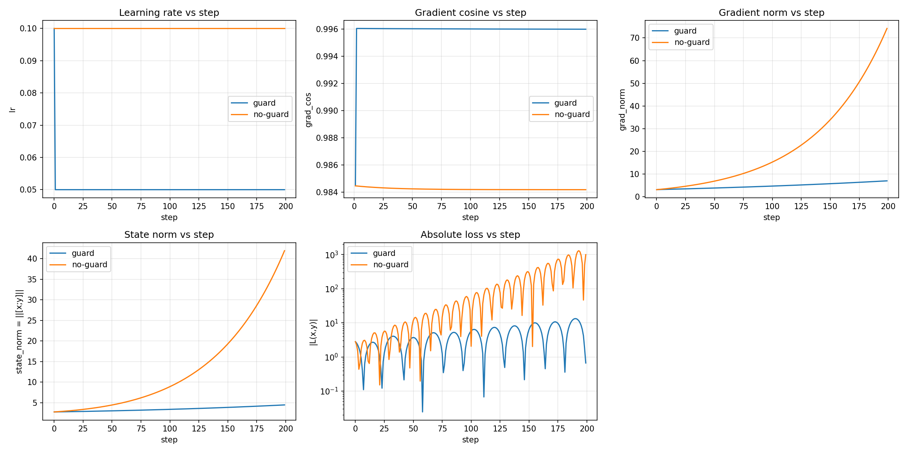

# SGN‑Guard

Certified‑style, stability‑first learning‑rate guard for decentralized training. Uses standard, non‑novel heuristics (gradient cosine, norm ratios, staleness) to reduce divergence under heterogeneity and asynchrony.

- Package: `sgn_guard`
- Status: Public‑ready minimal MVP
- License: MIT

## Features
- Optimizer wrapper that adjusts LR before each step (decrease fast on instability; increase slowly on alignment).
- Simple estimators: gradient cosine similarity, norm ratio checks, optional staleness input.
- Example: two‑player toy game (
`examples/simple_game.py`).
- Tests for core LR adaptation logic.

## Install (dev)
```bash
python -m venv .venv && source .venv/bin/activate
pip install -e ".[dev]"  # note: quote extras in zsh
```

## Quick start
```python
import torch
from sgn_guard.guard import SGNGuard, SGNGuardConfig

model = torch.nn.Linear(4, 4)  # stand‑in model
opt = torch.optim.SGD(model.parameters(), lr=1e-2)

config = SGNGuardConfig(lr_min=1e-5, lr_max=5e-2)
guard = SGNGuard(opt, config)

for step in range(100):
    opt.zero_grad()
    x = torch.randn(16, 4)
    loss = model(x).pow(2).mean()
    loss.backward()

    # Optional: report observed staleness (e.g., from PCCL/OpenDiLoCo)
    guard.observe_staleness(steps_behind=0)

    guard.adjust_before_step()  # adapt LR conservatively
    opt.step()
```

See `examples/simple_game.py` for a toy two‑player game loop using explicit ascent/descent grads.

## Toy game explained (plain language)
- Two players, variables `x` and `y`, interact through a bilinear objective `L(x, y) = x^T A y` with off‑diagonal coupling in `A`.
- This creates rotational dynamics (the gradient of one player pushes the other around). With a fixed LR, steps tend to orbit or blow up instead of settling.
- We simulate this because it exposes a common failure mode in decentralized/async training: misaligned gradients and effective step amplification from delays/heterogeneity.

What SGN‑Guard does here:
- Watches simple signals every step: gradient direction agreement (cosine), gradient size growth, and optional staleness.
- Cuts LR quickly on instability; raises it slowly when signals look safe. This keeps steps inside a conservative “safe zone.”
- Result: smaller oscillations, lower norms, and a more stable trajectory at the same nominal LR budget.

### Why not just lower LR globally?
- A tiny global LR makes everything slow—even when the system is stable. The guard only lowers LR when signals indicate risk, then lets it recover gradually.
- Time‑based schedulers (StepLR/Cosine) don’t look at alignment/staleness; they won’t react to sudden instability and may keep LR low when it’s safe.
- SGN‑Guard is a thin wrapper around your optimizer. It can coexist with schedulers, but it uses stability signals rather than time/epoch.

## Metrics & evidence
The examples emit machine‑readable metrics to demonstrate behavior:

```bash
# From repo root (after install)
python examples/simple_game.py

# Outputs:
# examples/metrics_simple_game.csv
# examples/metrics_simple_game.json
```

JSON summary fields include:
- `reductions`, `increases`, `none_actions`, `reductions_rate`
- `neg_cos_rate`, `lr_min/max/avg`, `staleness_avg`

Note: CSV/JSON outputs are generated and intentionally not tracked (see `.gitignore`) to keep the repo small. Reproduce by running the scripts above.

## Comparison: guard vs no‑guard
Run a side‑by‑side comparison on the toy game:

```bash
python examples/compare_guard_vs_noguard.py

# Outputs (JSON summaries + CSV traces):
# examples/metrics_compare_guard.json
# examples/metrics_compare_noguard.json
# examples/trace_compare_guard.csv
# examples/trace_compare_noguard.csv

# Generate plot (2×3: LR, grad cosine, grad norm, state norm, |loss|):
python examples/plot_compare.py

# Output:
# examples/compare_guard_vs_noguard.png
```



### What the plot shows
- **Learning rate**: guard typically takes an early reduction (e.g., 0.1 → 0.05) and holds steady; no‑guard stays constant.
- **Gradient cosine**: guard maintains higher alignment (closer to 1.0) vs no‑guard.
- **Gradient norm**: proxy for stationarity; guard keeps it significantly lower.
- **State norm**: stability indicator ‑ lower with guard.
- **|Loss| (log‑scale)**: lower and less explosive oscillations with guard.

### Typical result (toy off‑diagonal bilinear game, varies with seed/LR)
- ~4–5× lower average gradient norm.
- ~3–4× lower average state norm.
- ~30–40× lower average |loss|.

Numbers are reproducible from the JSON summaries and per‑step CSV traces above. Heuristics only; non‑novel.

## Design notes
- Heuristics only. No novel techniques disclosed.
- Conservative by default (favor reducing LR on uncertainty).
- Logs can be integrated with dashboards (LR, grad cosine, staleness).

## Testing
```bash
pytest -q
```

## Roadmap
- PCCL/OpenDiLoCo hooks for live staleness and link metrics.
- Per‑parameter‑group policies and richer signals.
- Minimal dashboards (Prometheus/Grafana) for reliability telemetry.
